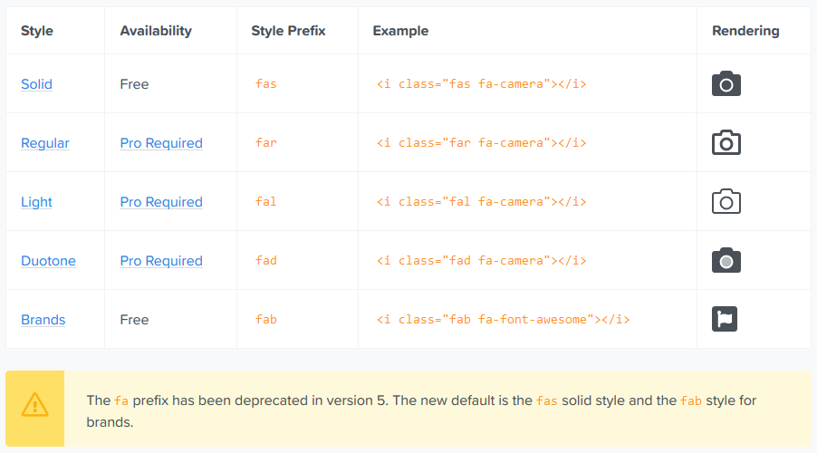

# Codealong Bootstrap

Este proyecto lo haremos solo con Bootstrap y utilizaremos la versión 4. (Sin CSS)

La documentación de Bootstrap4: 

https://getbootstrap.com/docs/4.0/getting-started/introduction/

## Head

- Empecemos a estructurar el HTML. Primero el head

```html
<!doctype html>
<html lang="en">
<head>
    <meta charset="utf-8">
    <meta name="viewport" content="width=device-width, initial-scale=1, shrink-to-fit=no">
    
    <!-- para agregar el favicon -->
    <link rel="shortcut icon" type="image/png" href="images/title-img.png">

    <!-- bootstrap 4 css -->
    <link rel="stylesheet" href="https://maxcdn.bootstrapcdn.com/bootstrap/4.0.0/css/bootstrap.min.css" integrity="sha384-Gn5384xqQ1aoWXA+058RXPxPg6fy4IWvTNh0E263XmFcJlSAwiGgFAW/dAiS6JXm" crossorigin="anonymous">

    <!-- íconos fontawesome -->
    <link rel="stylesheet" href="https://use.fontawesome.com/releases/v5.8.1/css/all.css" integrity="sha384-50oBUHEmvpQ+1lW4y57PTFmhCaXp0ML5d60M1M7uH2+nqUivzIebhndOJK28anvf" crossorigin="anonymous">

    <title>Pure Bootstrap Website</title>
</head>
```

- Ahora agregamos los **scripts**, antes del cierre del body, para que Bootstrap funcione correctamente:

```html
<!-- primero jQuery, luego Popper.js, y por último Bootstrap.js -->
<script src="https://code.jquery.com/jquery-3.3.1.slim.min.js" integrity="sha384-q8i/X+965DzO0rT7abK41JStQIAqVgRVzpbzo5smXKp4YfRvH+8abtTE1Pi6jizo" crossorigin="anonymous"></script>

<script src="https://cdnjs.cloudflare.com/ajax/libs/popper.js/1.14.7/umd/popper.min.js" integrity="sha384-UO2eT0CpHqdSJQ6hJty5KVphtPhzWj9WO1clHTMGa3JDZwrnQq4sF86dIHNDz0W1" crossorigin="anonymous"></script>

<script src="https://stackpath.bootstrapcdn.com/bootstrap/4.3.1/js/bootstrap.min.js" integrity="sha384-JjSmVgyd0p3pXB1rRibZUAYoIIy6OrQ6VrjIEaFf/nJGzIxFDsf4x0xIM+B07jRM" crossorigin="anonymous"></script>
```

## Navbar

- Al comienzo del body agregamos la **navbar**. Las navbar, en general, son muy similares unas con otras en Bootstrap. En la documentación están los ejemplos y el código


La navbar requiere un wrapping **.navbar** con **.navbar-expand{-sm|-md|-lg|-xl}** para un responsive collapsing. En este caso se va a colapsar (hamburger menu) en 991px.  
**navbar-light** afecta el color de la navbar y de la hamburguesa  
**bg-dark** background oscuro de la navbar  
**fixed-top** para que está siempre fija arriba

```html
<body>
<!-- navbar -->
<nav class="navbar navbar-expand-lg navbar-light bg-dark fixed-top">
```

- Agregamos el logo y lo encerramos en un anchor para que al cliquearlo nos redirija a la home

**navbar-brand** le aplica estilos de CSS al logo del sitio  
**fas fa-child** ícono de FontAwesome (en este caso representa el logo del sitio)  
**text-warning** para que el ícono sea amarillo (como el ícono es de FontAwesome, el color y tamaño se le asigna de igual manera que a un texto)  
**fa-2x** para agrandar un poco el tamaño del ícono (es equivalente a font-size: 2em;)

```html
    <a href="#" class="navbar-brand"><i class="fas fa-child text-warning fa-2x"></i></a>
```    

- menu hamburguer en mobile   
**navbar-toggler**  navigation toggling behaviors  
**bg-light** para que el background sea gris claro   
**navbar-toggler-icon**  ícono para mobile de rayitas (hamburguesa)

```html
    <button type="button" class="navbar-toggler bg-light" data-toggle="collapse" data-target="#nav"><span class="navbar-toggler-icon"></span></button>
```

- Añadimos dentro de un div los dos elementos que tendrá nuestra navbar: el *ul* y el *form*

**justify-content-between** es la propiedad de CSS justify-content: space-between; (es de flexbox - para posicionar los elementos horizontamente). Al agregar esta clase, se agrega automáticamente display:flex;  
**text-light** texto de color gris claro.  
**text-uppercase** para texto en mayúscula, similar a text-transform: uppercase;  
**font-weight-bold** para negrita, similar a font-weight: bold;  
**px-3** significa que le asignamos padding de 1rem en el eje X (right y left) - debajo el link para más info  
**dropdown** crea un dropdown

*más info de navbar:*  https://getbootstrap.com/docs/4.0/components/navbar/

*más info de spacing (mb-3, etc):*  https://getbootstrap.com/docs/4.0/utilities/spacing/

```html
    <div class="collapse navbar-collapse justify-content-between" id="nav">
        <ul class="navbar-nav">
            <li class="nav-item"><a class="nav-link text-light text-uppercase font-weight-bold px-3" href="#">Home</a></li>
            <li class="nav-item"><a class="nav-link text-light text-uppercase font-weight-bold px-3" href="#skills">Skills</a></li>

            <li class="nav-item dropdown">
                <a class="nav-link text-light text-uppercase font-weight-bold px-3 dropdown-toggle" data-toggle="dropdown" href="#">Projects</a>
                <div class="dropdown-menu">
                    <a href="#projects" class="dropdown-item">Project 1</a>
                    <a href="#projects" class="dropdown-item">Project 2</a>
                    <a href="#projects" class="dropdown-item">Project 3</a>
                    <a href="#projects" class="dropdown-item">Project 4</a>
                </div>
            </li>

            <li class="nav-item"><a class="nav-link text-light text-uppercase font-weight-bold px-3" href="#team">Team</a></li>
            <li class="nav-item"><a class="nav-link text-light text-uppercase font-weight-bold px-3" href="#contact">Contact</a></li>
        </ul>
```

- Agregamos el *form* dentro del mismo *div*, luego del cierre del *ul*

**form-inline** se utiliza para formulario inline (en una sola línea), y dentro se usan las clases *input-group* (en el wrap del input), *form-control* (en el input)  
**ml-3** significa que le asignamos margin-left de 1rem  
**fas fa-search** es el ícono de búsqueda (la lupa) de FontAwesome  
**input-group-append** para que el input y el botón se posicionen uno al lado de otro (sin espacios entre sí)  
**btn** siempre al agregar un botón utilizamos la clase btn y luego podemos definir su color, por ejemplo, **bg-light** para background light (gris claro)  
**text-muted** para texto de color gris  

*más info formularios:*  https://getbootstrap.com/docs/4.0/components/forms/

```html
        <form class="form-inline ml-3">
            <div class="input-group">
                <input type="text" class="form-control" placeholder="Search">
                <div class="input-group-append">
                    <button type="button" class="btn bg-light"><i class="fas fa-search text-muted"></i></button>
                </div>
            </div>
        </form>
    </div>
</nav>
<!--end of navbar-->
```

## Section Banner 

- Debajo de la navbar, añadimos el banner (header del sitio)

**pt-5** significa padding-top: 3rem;  
**container-fluid** para un "full width container", que abarca todo el ancho de la ventana gráfica.  
Luego agregamos **row** y luego las columnas, en este caso (col-sm-10).  
**col-sm-10** significa que para resoluciones más grandes a sm=576px el bloque ocupará 10 columnas y en resoluciones menores a 575px ocupará el default, ya que no lo especificamos (12 columnas --> 100% del width)  
**bg-info** para background azul  
**justify-content-center** significa justify-content: center; (es de flexbox - para posicionar horizontamente los elementos en el centro)  
**align-items-center** es similar a align-items: center; y es para posicionar verticalmente los elementos en el centro  
**display-3** se utiliza para destacar encabezados, va desde display-1 (más destacado, más grande), a display-4 (menos destacado, más pequeño)  
**text-warning** texto en color amarillo  
**font-weight-light** es similar a font-weight: 300;  
**px-4** padding-right y padding-left de 1.5rem  
**m-3** margin de 1rem (a los 4 lados)

```html
<!--banner-->
<section class="pt-5">
    <div class="container-fluid">
        <div class="row bg-info justify-content-center align-items-center" style="height: 100vh">
            <div class="col-sm-10 text-center">
                <h1 class="display-3 text-capitalize"><span class="text-warning">pure bootstrap</span><span class="text-white font-weight-bold"> website</span></h1>
                <h2 class="font-weight-light font-italic text-light">Lorem ipsum dolor sit amet, consectetur adipisicing elit.</h2>

                <a href="#" class="btn bg-warning btn-lg px-4 m-3 text-dark">Press Here</a>
                <a href="#" class="btn bg-danger btn-lg px-4 m-3 text-light">Press Here</a>
            </div>
        </div>
    </div>
</section>
<!--end of banner-->
```

## Section Skills

- Agregamos la sección Skills

**id="skills"** para que al cliquear en el elemento "Skills" de la navbar, haga scroll hasta esta sección.  
**p-5** padding: 3rem; (a los 4 lados).  
**container-fluid** para un "full width container", que abarca todo el ancho de la ventana.  
Luego agregamos **row** y luego las columnas, en este caso (col).  
**col** para que ocupe el 100% del width en todas las resoluciones de pantalla.  
**mb-3** margin-bottom: 1rem;  
**display-3** se utiliza para destacar encabezados, va desde display-1 (más destacado, más grande), a display-4 (menos destacado, más pequeño)  
**lead** para destacar un párrafo  
**text-secondary** para texto color gris  
**col-lg-4 col-sm-10**  resolución mayor a lg(992px) van a distribuirse en 3 columnas (cada col va a tener 33.33%), en resolución sm (entre 576px y 991px) va a tener un ancho de 83% y en menores de 100% (ya que es el default)   
**mx-auto**  margin-right: auto y margin-left: auto. Sirve para centrar en el eje x los elementos.  
**fas fa-desktop**  ícono de computadora  
**fas fa-edit** ícono de FontAwesome (en este caso representa el logo del lápiz)   
**fas fa-cogs** ícono de FontAwesome (en este caso representa el logo de las ruedas)   
**fa-6x**  para establecer el ícono con tamaño font-size: 6em;  
**my-4**  margin en el eje "y" de 1.5rem (margin-top: 1rem y margin-bottom: 1rem)  
**btn-outline-warning**  para que el botón sea transparente y que tenga un outline (borde) de color amarillo.

```html
<!--skills-->
<section id="skills" class="bg-light p-5">
    <div class="container-fluid">
        <div class="row">
            <div class="col text-center mb-3">
                <h1 class="text-warning display-3">Skills</h1>
                <p class="lead text-secondary">Lorem ipsum dolor sit amet, consectetur adipisicing elit. Culpa esse exercitationem ipsam!</p>
            </div>
        </div>
        
        <div class="row text-center">
            <div class="col-lg-4 col-sm-10 mx-auto mb-5">
                <i class="fas fa-desktop fa-6x text-warning mb-3"></i>
                <h1 class="text-secondary">Development</h1>
                <p class="text-muted my-4">Lorem ipsum dolor sit amet, consectetur adipisicing elit. Aliquam amet consequatur cupiditate deserunt dolor magnam officia quam quasi totam unde.</p>
                <a href="#" class="btn btn-outline-warning">Learn More</a>
            </div>

            <div class="col-lg-4 col-sm-10 mx-auto mb-5">
                <i class="fas fa-edit fa-6x text-warning mb-3"></i>
                <h1 class="text-secondary">Design</h1>
                <p class="text-muted my-4">Lorem ipsum dolor sit amet, consectetur adipisicing elit. Aliquam amet consequatur cupiditate deserunt dolor magnam officia quam quasi totam unde.</p>
                <a href="#" class="btn btn-outline-warning">Learn More</a>
            </div>

            <div class="col-lg-4 col-sm-10 mx-auto mb-5">
                <i class="fas fa-cogs fa-6x text-warning mb-3"></i>
                <h1 class="text-secondary">Creativity</h1>
                <p class="text-muted my-4">Lorem ipsum dolor sit amet, consectetur adipisicing elit. Aliquam amet consequatur cupiditate deserunt dolor magnam officia quam quasi totam unde.</p>
                <a href="#" class="btn btn-outline-warning">Learn More</a>
            </div>
        </div>
    </div>
</section>
<!-- end of skills-->
```

## Section Projects

- Agregamos la sección proyectos

**id="projects"** para que al cliquear en el elemento "Projects" de la navbar, haga scroll hasta esta sección.  
**p-5** padding: 3rem; (a los 4 lados).  
**img-thumbnail** para dar a una imagen un aspecto de bordes redondeados de 1 px    

```html
<!--projects-->
<section id="projects" class="p-5">
    <div class="container-fluid">
        <div class="row">
            <div class="col text-center mb-3">
                <h1 class="text-warning display-3">Projects</h1>
                <p class="lead text-secondary">Lorem ipsum dolor sit amet, consectetur adipisicing elit. Culpa esse exercitationem ipsam!</p>
            </div>
        </div>

        <div class="row">
            <div class="col-lg-3 col-sm-6">
                
                <h2 class="my-3 text-warning">Project 1</h2>
                <p class="text-muted">Lorem ipsum dolor sit amet, consectetur adipisicing elit. Ad, dolores?</p>
            </div>
            <div class="col-lg-3 col-sm-6">
                
                <h2 class="my-3 text-warning">Project 2</h2>
                <p class="text-muted">Lorem ipsum dolor sit amet, consectetur adipisicing elit. Ad, dolores?</p>
            </div>
            <div class="col-lg-3 col-sm-6">
                
                <h2 class="my-3 text-warning">Project 3</h2>
                <p class="text-muted">Lorem ipsum dolor sit amet, consectetur adipisicing elit. Ad, dolores?</p>
            </div>
            <div class="col-lg-3 col-sm-6">
                
                <h2 class="my-3 text-warning">Project 4</h2>
                <p class="text-muted">Lorem ipsum dolor sit amet, consectetur adipisicing elit. Ad, dolores?</p>
            </div>
        </div>

    </div>
</section>
<!--end of projects-->
```

## Section Team 

- Ahora vamos a añadir la sección team

**card**  es un contenedor flexible. Incluye opciones para encabezados y pies de página  
**card-img-top**  coloca una imagen en la parte superior de la card  
**card-body**  para el body/contenido de la card  
**card-title**  título de la card  
**card-subtitle**  subtítulo de la card  
**text-primary**  texto de color azul  
**text-info**  texto de color celeste  

*más info de card:* https://getbootstrap.com/docs/4.0/components/card/

```html
<!--team-->
<section id="team" class="p-sm-5 p-2 bg-secondary">
    <div class="container-fluid">
        <div class="row">
            <div class="col text-center mb-3">
                <h1 class="text-warning display-3">Team</h1>
                <p class="lead text-light">Lorem ipsum dolor sit amet, consectetur adipisicing elit. Culpa esse exercitationem ipsam!</p>
            </div>
        </div>

        <div class="row">
            <div class="col-lg-4 col-sm-10 mx-auto mb-4">
                <div class="card">
                    
                    <div class="card-body">
                        <div class="card-title">
                            <h3 class="text-muted">Michael</h3>
                        </div>
                        <div class="card-subtitle">
                            <p class="lead text-secondary">Lorem ipsum dolor sit amet.</p>
                        </div>
                        <div class="text-right">
                            <a href="#"><i class="fab fa-facebook fa-2x mx-2 text-primary"></i></a>
                            <a href="#"><i class="fab fa-twitter fa-2x mx-2 text-info"></i></a>
                            <a href="#"><i class="fab fa-youtube fa-2x mx-2 text-danger"></i></a>
                        </div>
                    </div>
                </div>
            </div>
            <div class="col-lg-4 col-sm-10 mx-auto mb-4">
                <div class="card">
                    
                    <div class="card-body">
                        <div class="card-title">
                            <h3 class="text-muted">Jack</h3>
                        </div>
                        <div class="card-subtitle">
                            <p class="lead text-secondary">Lorem ipsum dolor sit amet.</p>
                        </div>
                        <div class="text-right">
                            <a href="#"><i class="fab fa-facebook fa-2x mx-2 text-primary"></i></a>
                            <a href="#"><i class="fab fa-twitter fa-2x mx-2 text-info"></i></a>
                            <a href="#"><i class="fab fa-youtube fa-2x mx-2 text-danger"></i></a>
                        </div>
                    </div>
                </div>
            </div>
            <div class="col-lg-4 col-sm-10 mx-auto mb-4">
                <div class="card">
                    
                    <div class="card-body">
                        <div class="card-title">
                            <h3 class="text-muted">Ann</h3>
                        </div>
                        <div class="card-subtitle">
                            <p class="lead text-secondary">Lorem ipsum dolor sit amet.</p>
                        </div>
                        <div class="text-right">
                            <a href="#"><i class="fab fa-facebook fa-2x mx-2 text-primary"></i></a>
                            <a href="#"><i class="fab fa-twitter fa-2x mx-2 text-info"></i></a>
                            <a href="#"><i class="fab fa-youtube fa-2x mx-2 text-danger"></i></a>
                        </div>
                    </div>
                </div>
            </div>
        </div>
    </div>
</section>
<!--end of team-->
```

## Section Progress

- Agregaremos la sección progreso

**progress**  el contenedor para indicar el valor máximo de la barra de progreso  
**progress-bar** para indicar el progreso hasta ahora  
**bg-danger**  background rojo  

*más info de progress:* https://getbootstrap.com/docs/4.0/components/progress/

```html
<!--progress-->
<section class="p-5">
    <div class="container-fluid">
        <div class="row">
            <div class="col text-center mb-3">
                <h1 class="text-warning display-3">Progress</h1>
                <p class="lead text-secondary">Lorem ipsum dolor sit amet, consectetur adipisicing elit. Culpa esse exercitationem ipsam!</p>
            </div>
        </div>

        <div class="row justify-content-center">
            <div class="col-lg-6 text-secondary">
                <h2>HTML</h2>
                <div class="progress bg-secondary mb-3">
                    <div class="progress-bar" style="width: 50%;">
                        50%
                    </div>
                </div>
                <h2>CSS</h2>
                <div class="progress bg-secondary mb-3">
                    <div class="progress-bar bg-danger" style="width: 70%;">
                        70%
                    </div>
                </div>
                <h2>JavaScript</h2>
                <div class="progress bg-secondary mb-3">
                    <div class="progress-bar bg-warning" style="width: 90%;">
                        90%
                    </div>
                </div>
                <h2>Boostrap</h2>
                <div class="progress bg-secondary mb-3">
                    <div class="progress-bar bg-success" style="width: 95%;">
                        95%
                    </div>
                </div>
            </div>
        </div>
    </div>
</section>
<!--end of progress-->
```

## Section Contact

**form-group** es la forma más fácil de agregar algo de estructura a los formularios. Proporciona una clase flexible que fomenta la agrupación adecuada de labels, controles, texto de ayuda opcional y mensajes de validación de formularios  
**form-control** estilos de apariencia general, focus, tamaño, etc. para input, select y textarea  
**btn-block**  para crear un botón de bloque, aquellos que abarcan todo el ancho de un elemento padre  

```html
<!--contact-->
<section id="contact" class="p-5 bg-light">
    <div class="container-fluid">
        <div class="row">
            <div class="col text-center mb-3">
                <h1 class="text-warning display-3">Contact Us</h1>
                <p class="lead text-secondary">Lorem ipsum dolor sit amet, consectetur adipisicing elit. Culpa esse exercitationem ipsam!</p>
            </div>
        </div>
        <div class="row justify-content-center">
            <div class="col-lg-6 col-md-8 col-sm-10">
                <div class="text-center text-secondary">
                    <h2>Got question?</h2>
                    <p>Stay Connected</p>
                </div>
                <form action="" class="text-muted">
                    <div class="form-group">
                        <label for="name">Name</label>
                        <input type="text" class="form-control" id="name">
                    </div>
                    <div class="form-group">
                        <label for="email">Email</label>
                        <input type="text" class="form-control" id="email">
                    </div>
                    <div class="form-group">
                        <label for="message">Message</label>
                        <textarea class="form-control" name="" id="message" rows="3"></textarea>
                    </div>
                    <button class="btn btn-outline-warning btn-block" type="submit">Submit Question</button>
                </form>
            </div>
        </div>
    </div>
</section>
<!--end of contant-->
```

## Footer

- Por último, agregamos el footer

**m-0**   margin: 0; en sus 4 lados.  

```html
<!--footer-->
<footer class="bg-secondary p-3">
    <div class="container">
        <div class="row">
            <div class="col text-center">
                <h3 class="text-white font-weight-light">Pure Bootstrap Project</h3>
                <h4 class="text-light font-weight-light font-italic mb-3">Lorem ipsum dolor sit amet.</h4>
                <div class="py-2">
                    <a href="#"><i class="fab fa-facebook fa-2x text-primary mx-3"></i></a>
                    <a href="#"><i class="fab fa-google-plus fa-2x text-danger mx-3"></i></a>
                    <a href="#"><i class="fab fa-twitter fa-2x text-info mx-3"></i></a>
                    <a href="#"><i class="fab fa-youtube fa-2x text-danger mx-3"></i></a>
                </div>
                <p class="text-light pt-4 m-0">&copy;Copyright 2019</p>
            </div>
        </div>
    </div>
</footer>
<!--end of footer-->
```

- Observemos...  
Algunas veces al agregar íconos de FontAwesome utilizamos "fas fa-...", otras "fab fa-..."  
Esto se debe a la nueva versión 5 de FontAwesome:  
https://fontawesome.com/how-to-use/on-the-web/referencing-icons/basic-use  

